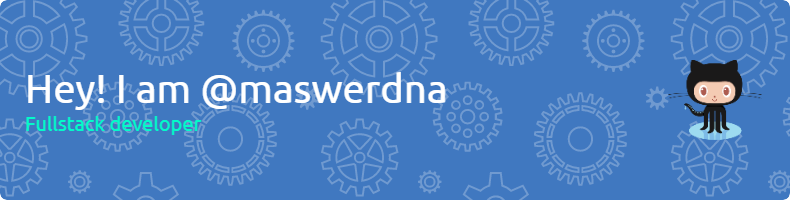

_That moment when you realize that maswerdna is "andrew sam" spelt backwards. :winks: 👋👋👋_

Here you would learn a bit about the simple and the complex stuffs I've dipped my hands into over the past 6 years as a software developer. My contributions, my passion and my aspirations.

- 🌱 I’m currently learning React Native
- 💞️ I’m looking to collaborate on Open Source JavaScript and PHP projects

### Mas on Stackoverflow

### Mas on GitHub

## 👀 I’m interested in

    
    

## 🌱 I build stuffs with

    
    
    
    
    

## 📫 You can reach me elsewhere

  
  
  
  
  
  

 

<!---
maswerdna/maswerdna is a ✨ special ✨ repository because its `README.md` (this file) appears on your GitHub profile.
You can click the Preview link to take a look at your changes.
--->
